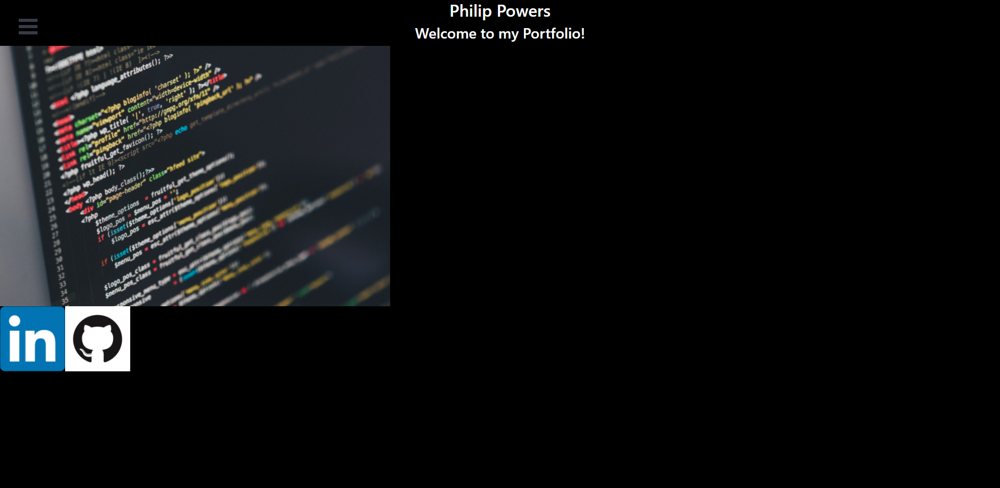

React Portfolio

> Personal Portfolio created through react  
>[Personal Portfolio](https://personal-react-portfolio1.herokuapp.com/)
## Table of Contents
* [Description](#Description)
* [General Info](#General-Info)
* [Features](#Features)
* [ScreenShot](#ScreenShot)
## Description
Using mongoose, this application shows 6 projects I've worked on and an about me section.
## General Info
Using react I created a portfolio for myself to display my projects
## Features
* About me section
* Projects section
* Contact links in footer
### ScreenShot

